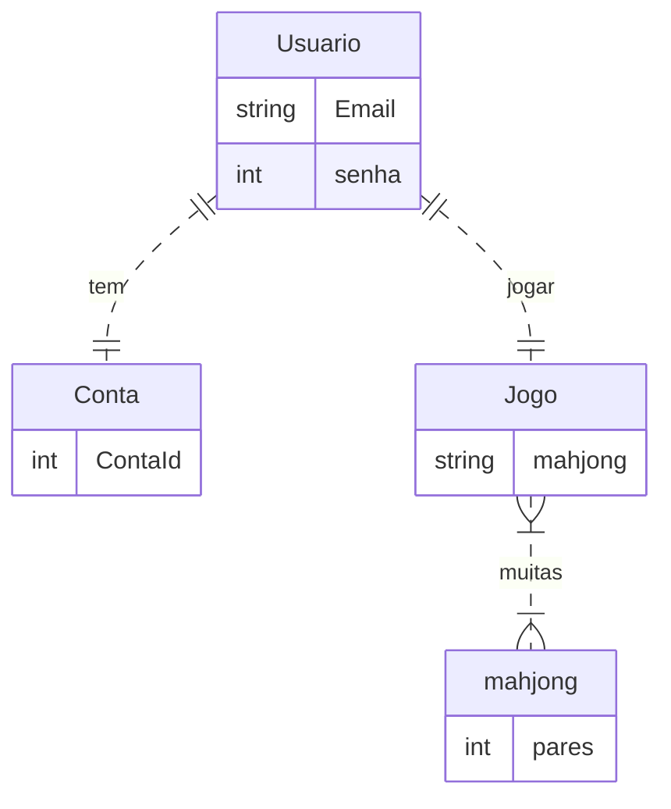

```mermaid

erDiagram
    Usuario ||..||Conta : tem
    Usuario {
    string Email
    int senha
    }
    Conta{
        int  ContaId
    }
    Usuario ||..||Jogo : jogar
    mahjong {
       int pares
    }
    Jogo }|..|{mahjong: muitas
    Jogo {
        string mahjong

    }
    
```
